# 🎓 Crypto Orienting - Program and Progression Guide

---

## 📋 Dependency Matrix (Read as: you must complete ALL rows to access the module)

| Module | Mandatory Prerequisites |
|--------|--------------------------|
| **M0: Exchange** | M1 |
| **M1: Bitcoin & Wallet** | ✅ ENTRY POINT |
| **M2: Ethereum & Smart Contract** | M0 + M1 |
| **M3: Scaling & L2** | M2 |
| **M4: Altcoin & Portfolio** | M1 |
| **M5: DAO & Governance** | M2 |
| **M6: Anti-Fraud** | M1 |
| **M7: Geopolitics** | *(recommended M1 + M2)* |
| **M8: Advanced DeFi** | M1 + M2 + M3 + M4 |
| **M9: Privacy Protocols** | M1 |
| **M10: Intelligence On-Chain** | M1 + M2 + M6 + (M9) |
| **M11: Legal & Compliance** | M0 + M1 + M2 + M6 + (M10) |

---



```mermaid
graph TD
    START["START<br/>Begin here"]
    
    M1["M1: Bitcoin & Wallet<br/>✅ ENTRY POINT<br/>Prerequisites: NONE"]
    
    M0["M0: Exchange<br/>Prerequisites: M1"]
    M4["M4: Altcoin & Portfolio<br/>Prerequisites: M1"]
    M6["M6: Anti-Fraud<br/>Prerequisites: M1"]
    M9["M9: Privacy Protocols<br/>Prerequisites: M1"]
    
    M2["M2: Ethereum & Smart Contract<br/>Prerequisites: M0 + M1"]
    
    M3["M3: Scaling & L2<br/>Prerequisites: M2"]
    M5["M5: DAO & Governance<br/>Prerequisites: M2"]
    
    M8["M8: Advanced DeFi<br/>Prerequisites: M1 + M2 + M3 + M4"]
    M10["M10: Intelligence On-Chain<br/>Prerequisites: M1 + M2 + M6 + Recommended M9"]
    
    M11["M11: Legal & Compliance<br/>Prerequisites: M0 + M1 + M2 + M6 + Recommended M10"]
    
    M7["M7: Geopolitics<br/>Prerequisites: none mandatory<br/>Recommended: M1 + M2"]
    
    START --> M1
    
    M1 --> M0
    M1 --> M4
    M1 --> M6
    M1 --> M9
    
    M0 --> M2
    M1 --> M2
    
    M2 --> M3
    M2 --> M5
    M2 --> M10
    
    M1 --> M8
    M2 --> M8
    M3 --> M8
    M4 --> M8
    
    M1 --> M10
    M6 --> M10
    M9 --> M10
    
    M0 --> M11
    M1 --> M11
    M2 --> M11
    M6 --> M11
    M10 --> M11
    
    M1 -.->|recommended| M7
    M2 -.->|recommended| M7
```

## 🎯 Recommended Paths by Profile

### 🔴 Conservative Hodler (4 modules - ~4-6 weeks)
**Goal:** Buy, hold, and protect your Bitcoin

```
M1 → M0 → M6 → M11
```

---

### 🟠 DeFi Expert (8 modules - ~10-12 weeks)
**Goal:** Complete mastery of decentralized finance

```
M1 → M0 → M2 → M3 → M6 → M4 → M8 → M10
```

---

### 🟡 Security Researcher (9 modules - ~13-15 weeks)
**Goal:** Security analysis, fund tracing, investigation

```
M1 → M0 → M2 → M3 → M6 → M8 → M9 → M10 → M11
```

---

### 🟢 DAO Contributor (8 modules - ~9-11 weeks)
**Goal:** Active participation in decentralized governance

```
M1 → M0 → M2 → M3 → M5 → M4 → M6 → M11
```

---

### 🔵 Privacy Advocate (7 modules - ~10-12 weeks)
**Goal:** Privacy protection, anonymity, surveillance evasion

```
M1 → M0 → M2 → M6 → M9 → M10 → M11
```

---

### ⚫ Full Stack Expert (Complete - 12 modules - ~17-19 weeks)
**Goal:** Total competency in the crypto ecosystem

```
M1 → M0 → M2 → M3 → M4 → M5 → M6 → M7 → M8 → M9 → M10 → M11
```

---

# 📚 COMPLETE MODULE PROGRAM

---

## Module 0 - Exchange

This module provides operational foundations for those who want to enter the cryptocurrency world through exchanges. It explores fundamental concepts such as the orderbook, trading fees, and differences between centralized and decentralized exchanges. It illustrates practical methods to purchase cryptocurrencies, both through traditional exchanges and alternative methods, and discusses strategies for securely managing multiple accounts. The goal is to provide students with tools to enter the market consciously, reducing operational risks and costs.

**Key Questions:**
- What is an orderbook?
- How do I buy cryptocurrencies?
- How do I know the fees?
- Why is it better to have more than one exchange account?
- How can I buy crypto without using an exchange?
- What are stop loss / take profit orders and how can they become a double-edged sword?
- What is leverage, how does it work, and how can it be obtained?
- How can leverage completely ruin an investment?
- What is meant by On-Ramp and Off-Ramp?
- What is slippage?

---

## Module 1 – Bitcoin and Wallet

This module introduces Bitcoin fundamentals and key concepts related to wallet management. It explores blockchain structure, security offered by cryptographic keys, and mechanisms that guarantee immutability and ownership of digital assets. It will be an opportunity to understand differences between custodial and non-custodial wallets, the logic of transactions via UTXO, and advanced tools like the Lightning Network for making transactions fast and scalable.

**Key Questions:**
- Why is Bitcoin's blockchain immutable?
- What is Proof of Work and what makes it possible?
- How are new Bitcoins distributed? Is there a limit?
- What is the difference between a custodial and non-custodial wallet?
- What is a private key and why does it represent true ownership of a digital asset?
- What are the risks of not correctly storing a seed?
- Can other people see what I do on-chain? How?
- What is a UTXO and what role does it play in Bitcoin transaction logic?
- What is a Fork and how can it occur?
- What is the Lightning Network?
- What is a Mempool?
- What is a Mining Pool?
- What is a Block Explorer?

---

## Module 2 – Ethereum and Smart Contract

This module focuses on Ethereum, the leading platform for smart contracts and decentralized applications (dApps). It explains concepts of Proof of Stake, new ETH issuance, and the autonomous nature of smart contracts. It deepens token standards (ERC20, NFT), stablecoins, and how decentralized finance tools work, along with systemic risks and methodologies for inspecting and interacting with smart contracts safely.

**Key Questions:**
- What is Proof of Stake and what makes it possible?
- How are new Ethereum distributed? Is there a limit?
- What is a smart contract and what distinguishes it from a normal program?
- What are the "primitives" of decentralized finance (ERC20, DEX, Money Market) and what do they enable?
- What is a stablecoin? What types exist and what risks do they carry (collateralized, algorithmic, hybrid)?
- What is proof of reserve?
- How do you know when your portfolio presents systemic risks?
- Can smart contracts be controlled by administrators or central entities? How?
- Can I inspect a smart contract? How do I view public functions and variables?
- What is liquid staking and how does a yield-bearing asset work?
- What is an NFT and what are its concrete uses (Example: narrow LP, collectible, ticket, access key, unique asset)?
- What is a Multi-signature wallet, what is it used for?
- How does an AMM (Automated Market Maker) technically work and what formula is it based on?
- What is Impermanent Loss and who does it affect? Who is the counterparty?
- What is the difference between NFT token standards ERC-721 and ERC-1155?
- What are NFT metadata and why is it important to know where they are stored (e.g., on-chain vs IPFS vs private server)?
- What is a dApp (Decentralized Application) and how do you interact with it (connect wallet, sign, approve)?
- What is the difference between a CEX (Centralized Exchange) and a DEX (Decentralized Exchange) in terms of risks and benefits for users?
- What are the different types of LP and how do they differ?

---

## Module 3 - Scaling and Information Retrieval Solutions

The third module addresses scalability solutions and data management for high-throughput blockchains. It analyzes Layer 2, sidechains, rollups, oracles, and bridges, comparing monolithic and modular architectures. The goal is to understand how to improve speed, reduce costs, and maintain security and decentralization, as well as understand the importance of audits in evaluating dApp reliability.

**Key Questions:**
- What are Layer 2 (L2) solutions and why do they exist?
- What is the difference between Optimistic Rollup and ZK-Rollup?
- What are Sidechains (e.g., Polygon PoS)?
- What are Oracles (e.g., Chainlink) and why are they fundamental to DeFi?
- What are Bridges and what security risks do they carry?
- What is the difference between a "Monolithic" blockchain architecture (e.g., Solana) and a "Modular" one (e.g., Ethereum + L2)?
- What is a dApp audit? Is it only a code audit or is there more?

---

## Module 4 – Altcoin Integration and Portfolio Management

This module introduces portfolio management containing alternative cryptocurrencies (altcoins). It discusses risk analysis, relative performance versus Bitcoin, differences between tokens and cryptocurrencies, and tokenomics principles. Attention will be placed on ways to evaluate historical appreciation of altcoins and how to build a balanced and informed portfolio.

**Key Questions:**
- When do I realize my portfolio has too high risk?
- How do I measure the actual performance of alternative coins?
- What is the difference between Token and Cryptocurrency?
- What is tokenomics and how do you study it for a single token/cryptocurrency?
- Historically, what has been the average appreciation of altcoins compared to Bitcoin?
- What role does an asset's market capitalization play in allocation weighting?

---

## Module 5 - DAO and Governance

Here we explore the world of Decentralized Autonomous Organizations (DAOs), organizations governed through smart contracts. It explains how to propose and vote on proposals, delegate voting power, and monitor the impact of decisions. The module provides practical tools to actively participate in the governance of decentralized ecosystems.

**Key Questions:**
- What is a DAO and how does it work?
- How do I inspect the votes on a proposal?
- How do I propose a proposal?
- How do I vote on a proposal?
- How can I delegate my voting power?
- How do I check the impact of votes?
- How do I participate in the implementation?

---

## Module 6 - Protection Against Fraud Types

The sixth module focuses on security and fraud prevention in the crypto world. It analyzes signals of fraudulent platforms, most common scam techniques (romance scam, crypto drainer, malware wallet, phishing), and practical precautions to protect funds and data. It also explores the phenomenon of influencer memecoins and the risks associated with speculation.

**Key Questions:**
- How do I distinguish a fraudulent platform?
- What tools can I use to stay in a safe environment?
- What is PigButchering/romance scam?
- What is a crypto drainer and how is it typically used?
- What is a malware wallet? How do I avoid it?
- What is a seed phishing popup? How do I avoid it?
- How can influencer-memecoins completely destroy your portfolio's value?
- What does it mean when you have a sweeper-bot on your wallet? What can you do?

---

## Module 7 - Geopolitics

This module explores the interaction between cryptocurrencies, excess energy recapitalization, prediction markets, insider trading, and geopolitical dynamics. It analyzes how tools like Polymarket can create incentives for improbable events to occur, influencing the decisions of politicians or publicly exposed people. It also examines Bitcoin's impact on the global economy as a function of adoption curve, the role of CBDCs in centralizing economic control, and the macroeconomic consequences of tokenizing sovereign debt.

**Key Questions:**
- How can excess energy be recapitalized?
- How does Bitcoin impact the global economic system depending on adoption curve positioning?
- How does Polymarket alter the outcome of the bet itself? What impact can it have on politicians or visibly exposed people?
- How can a CBDC be used to centralize economic control at the national level?
- What are the geopolitical consequences of tokenizing sovereign debt assets?
- What is the link between global inflation, public debt, and demand for scarce digital assets like Bitcoin?
- What happens to macroeconomic balances if Bitcoin becomes a systemic collateral in derivatives markets?
- How does the nature of power change when "data" is public but interpretation is monopolized by those with the best analysis algorithms?

---

## Module 8 - Advanced DeFi

Here we deepen strategies and risks of advanced decentralized finance (DeFi). We discuss MEV bots, flashloans, frontrun, sandwich attacks, and on-chain arbitrage, analyzing the interaction between smart contracts, liquidity, and nodes. The goal is to understand how to exploit complex opportunities and prevent losses due to unshielded operations or sophisticated attacks.

**Key Questions:**
- What is a MEV bot and what tools do you have to read the logic of their transactions?
- What is a flashloan and what are the risks?
- What is a frontrun attack and how do I avoid becoming a victim?
- What is a flashloan attack?
- What is a sandwich attack?
- What does Just in Time liquidity mean?
- What is instant on-chain arbitrage? What is the simplest example?
- What is a liquidator bot? What type of program does it need off-chain?
- What is node latency and how can it impact complex MEV strategies?

---

## Module 9 - Privacy Protocols

The ninth module explores protocols for privacy in blockchain. It analyzes technologies such as Zero-Knowledge Proofs, private nodes, privacy coins, and mixers, explaining how to protect identity and funds. It will show how transactions can reveal information to those observing them and what tools are available to anonymize cryptocurrency flows.

**Key Questions:**
- Is Bitcoin properly fungible? Justify your answer.
- What is Zero-Knowledge Proof? Can you demonstrate with an example how it works?
- What are private nodes for? What do they protect you from?
- What are privacy coins?
- How can the node chosen to propagate your transaction across the network collect information about your transaction?
- What is a Mixer? What are the main heuristics for determining the destination and/or origin of funds? When is it impossible?
- What is a coinjoin transaction?

---

## Module 10 - On-Chain Intelligence

This module introduces advanced on-chain tracing and analysis techniques, including demixing strategies to separate aggregated fund flows. It discusses tracing tools, time/amount correlation, identification of malicious bridges and smart contracts, address attribution, and blacklist verification. The goal is to develop investigative abilities to understand origins, destinations, and risks of cryptocurrency flows, with particular attention to complex on-chain fund behaviors.

**Key Questions:**
- What is a tracing tool?
- What does time/amount correlation mean and what is it used for?
- How do I trace the origin/destination of some funds?
- How do I decipher the destination of a bridge if a specific explorer is not available?
- How do I decipher the behavior of a malicious contract?
- How do I determine when an address belongs to a service?
- How can I attempt to attribute the address to services?
- How do I identify a deposit address?
- How do I check if an address has been blacklisted by an ERC20 administrator?
- How do I determine the outbound transaction from a Bitcoin peel chain?
- What does clustering mean and what is it used for?
- What is gas trail?
- What is an OP return and what information can it contain?
- What is overflow demonstration?

---

## Module 11 - Legal Obligations and Requisition

The final module addresses the regulatory framework related to cryptocurrencies. It will analyze legal obligations for exchanges and services, blacklist functions in ERC20, cross-jurisdiction collaboration, differences in ownership and fungibility, and KYC/AML and Travel Rule. It will highlight how European regulation (MiCA) and U.S. regulation (SEC) impact users' privacy, security, and operability.

**Key Questions:**
- Which entities have legal obligations if they receive stolen funds?
- What does it mean when an ERC20 has a blacklist function?
- In what ways is it possible to make institutions collaborate across international borders?
- What is the legal difference between unique and fungible property?
- What is meant by KYC (Know Your Customer) and AML (Anti-Money Laundering) and why are they required by exchanges?
- What is the difference in regulatory approach between Europe (MiCA) and the United States (SEC)?
- What is the "Travel Rule" and how does it impact transaction privacy between exchanges?
- What happens to seized crypto?

---
